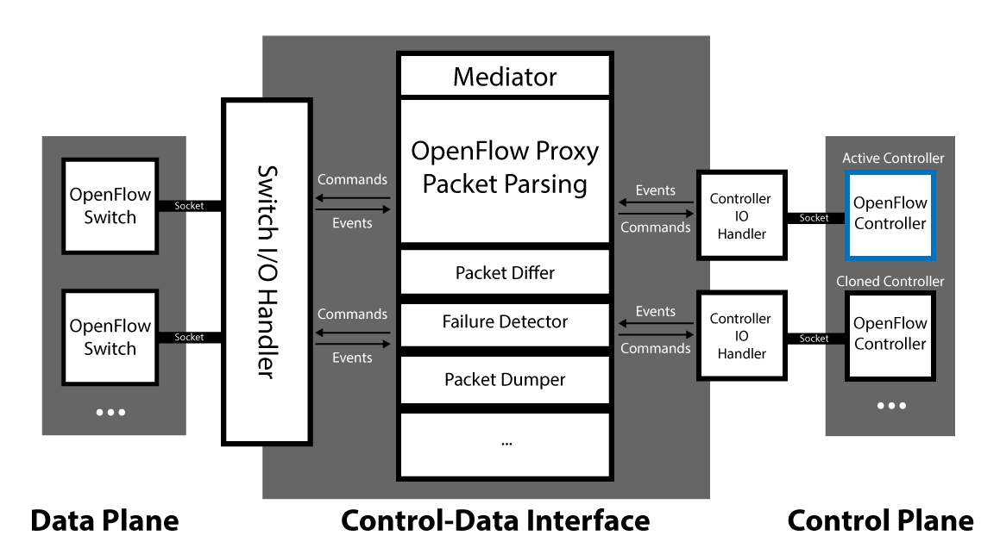
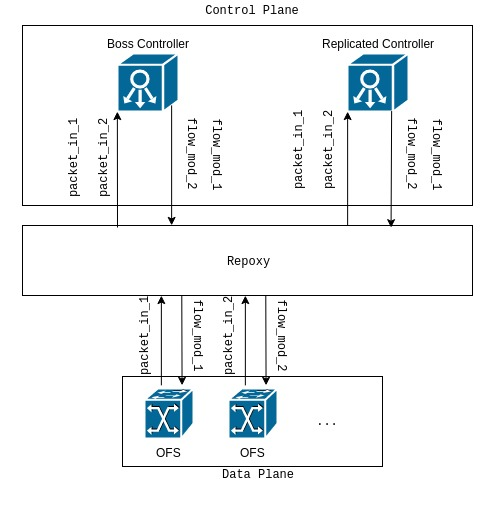
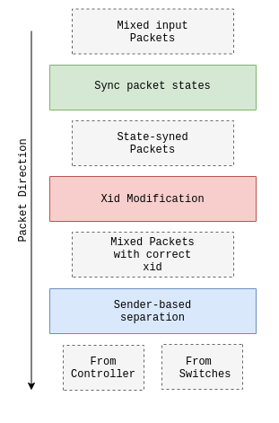

# Repoxy
It's a special type of a proxy server that aims to make multiple controllers manage a single SDN network to increase reliability of the network. This way the SDN network can still operate if its main controller failed (given that tehre's at least one other controller attached to Repoxy) without any need to sync the network state.

The task that seems to be easy but this is absolutely not true as there are some protocol details that need to be handled. Some of the problems are packet synchronization (since packets from controllers might arrive at different times) and xid synchronization for each OpnFlow conversation.

This project is implmented for  [this](https://ieeexplore.ieee.org/document/8455887/) paper, published in IEEE TrustCom2018.


note: (This code isn't production ready).



*Full details are included in the paper*

The following images illustrate some of the architectural components and functionality of Repoxy

## Packet synchronization

If two controllers send a feature request packet, each one of the controllers will issue a different xid to the request packet. As the protocol specifies, the xid field must be the same in request & reply packets. 

Repoxy will wait the reply packet from the switch then modify the xid based on the ones assigned by each controller, then *refabricates* the reply packet with the correct xid corresponding to the controller's request. 
Before modifying the xid we must be sure that the state of the packets is synced, i.e. if we get 2 consecutive request packets from one controller (for example) the replies of the switch must be returned in the same order Repoxy has to figure out the reply packet corresponds to whiich request. With requests coming from switches and controllers, having more than one switch and more than one controller in the network, the task becomes tedious.




#### Development Tips
- don't forget to mark the `generated` directory as generated sources in the IDE 
- Test automation scripts are [here](https://github.com/shakram02/Repoxy-Scripts)
  - During my tests, I used 3 machines 2 of them are virtual, I placed the network simulated using mininet and Repoxy on my PC and hosted one controller on a VM. The test scripts simulate somoe scenarios and tries to make things more straight forward since switching between multiple VMs to make sure that everything starts on time was very boring to me.

#### Testing
- Start the two controllers and obtain their IPs and Port numbers
- Start repoxy after assigning the IPs and Port Numbers of the controllers, There is a GUI app that can facilitate the task
- When Repoxy starts it'll print out its IP and port
- Open mininet and establish your network, set the controller IP for each of the switches as Repoxy's IP
- Run mininet network and watch the logs.

#### Misc

Adding OpenFlow for `Wireshark` [here](http://xmodulo.com/monitor-openflow-messages.html)
Capture filter for `Wireshark`

```
tcp && not tcp.len==0 && (tcp.dstport==6833 || tcp.dstport==6834 || tcp.dstport==6835 || tcp.srcport==6833 || tcp.srcport==6834 || tcp.srcport==6835 )
```
